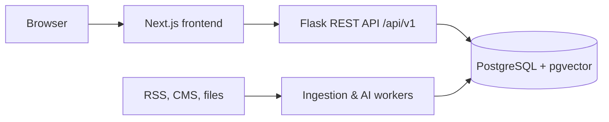

# Target architecture

## Boundaries

- **Next.js** owns routes, rendering, accessible UI and the public deployment on Vercel.
- **Flask** owns authentication, authorization, content, feedback and persistence.
- **PostgreSQL** is the system of record. Content is never stored only in frontend JSON.
- **Workers** are a future, isolated layer for ingestion, SDG classification and semantic indexing. They write draft content and annotations; a reviewer publishes it.

## API contract

The current API is available under `/api`. New endpoints must be added under `/api/v1` and documented in OpenAPI before frontend integration. Public content listing supports `q`, `category`, `page` and `page_size` now, so large content collections are not downloaded to the browser in full.

## Data model roadmap

Keep `users`, `contents`, `favorites`, and `feedback`. Add `content_types`, `sdg_goals`, `content_sdg_goals`, `tags`, `content_tags`, `content_translations`, `activities`, `ingestion_jobs`, `content_ai_annotations`, and `content_embeddings`. Use PostgreSQL full-text indexes first; add `pgvector` for semantic search after the content ingestion pipeline is stable.
